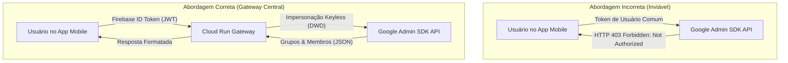
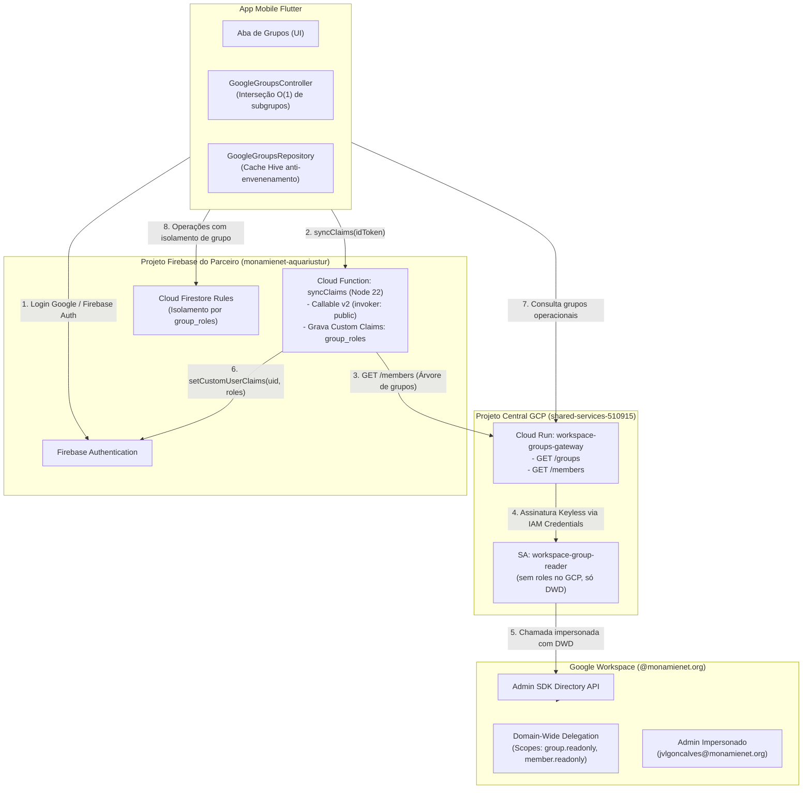
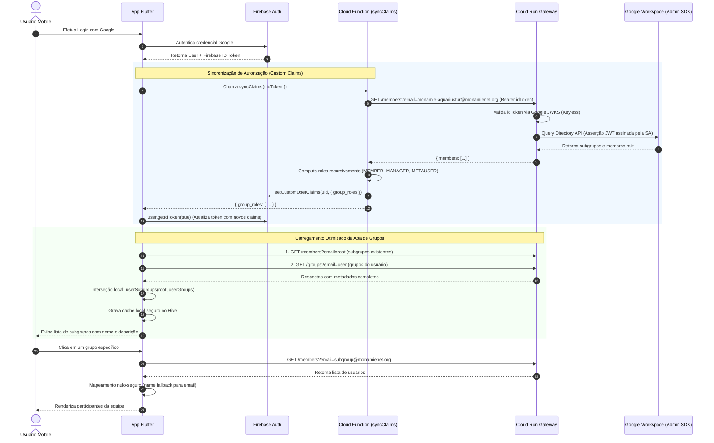
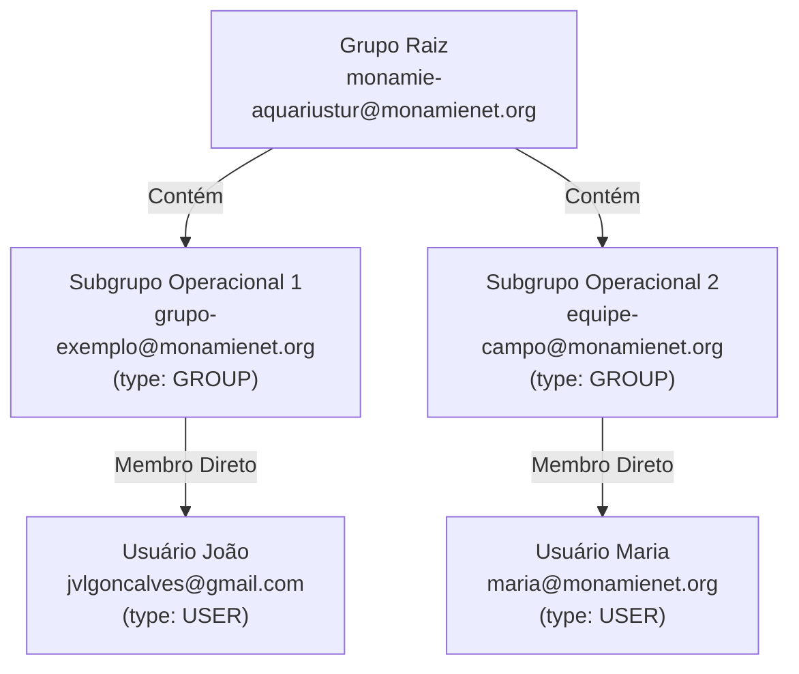

# Guia Definitivo de Arquitetura e Integração: Google Workspace Groups, Cloud Run Gateway & Whitelabel Firebase

Este documento consolida o conhecimento técnico e arquitetural necessário para integrar o gerenciamento de equipes do **Google Workspace Groups** a aplicações whitelabel Flutter suportadas pelo **Firebase**.

Ele sintetiza o caminho crítico mais curto, didático e livre de armadilhas, cobrindo os conceitos fundamentais, os atores envolvidos, os diagramas de fluxo e o passo a passo de configuração da infraestrutura e do código.

---

## 1. Fundamentos & Decisões Arquiteturais

### 1.1. O Desafio de Negócio
A plataforma MonAmieNet adota um modelo **whitelabel multi-inquilino (multi-tenant)**:
* Cada cliente parceiro possui sua própria instância do app e seu próprio **Projeto Firebase** isolado (com Firestore, Authentication e regras de segurança próprias).
* A hierarquia corporativa de equipes (grupos e subgrupos operacionais) é gerida centralmente no **Google Workspace** do domínio corporativo (`@monamienet.org`).

### 1.2. Limitações de APIs de Consumidor vs. Corporativas
* **Contas `@gmail.com` e grupos `@googlegroups.com` NÃO possuem API REST pública** para listagem programática de membros ou grupos de um usuário.
* O **Google Workspace Admin SDK Directory API** é exclusivo para domínios corporativos (`@monamienet.org`, etc.).
* Essa API exige privilégios de **Super Administrador** do Workspace ou **Delegação em Todo o Domínio (Domain-Wide Delegation - DWD)**. Usuários comuns de aplicativo mobile não podem nem devem chamar essa API diretamente.



---

## 2. Atores e Responsabilidades

Para entender o fluxo, é fundamental mapear cada componente do ecossistema:

| Ator | Onde vive? | Responsabilidade |
| :--- | :--- | :--- |
| **Google Workspace Directory** | Domínio `@monamienet.org` | Fonte da verdade sobre usuários, grupos e hierarquias de equipes. |
| **Service Account do Gateway** (`workspace-group-reader`) | Projeto Central GCP (`shared-services`) | Possui **Domain-Wide Delegation** no Workspace para impersonar um admin e ler os grupos via Admin SDK. |
| **Cloud Run Gateway** (`workspace-groups-gateway`) | Projeto Central GCP (`shared-services`) | Microsserviço Express. Valida o Firebase ID Token de qualquer parceiro via JWKS e consulta a Directory API de forma *keyless*. |
| **Projeto Firebase do Cliente** (`monamienet-<cliente>`) | GCP / Firebase do Inquilino | Armazena dados no Firestore e hospeda a Cloud Function de autorização. |
| **Cloud Function** (`syncClaims`) | Projeto Firebase do Cliente | Navega recursivamente na árvore de grupos via Gateway e grava os Custom Claims (`group_roles`) no Firebase Auth do usuário. |
| **App Flutter (Cliente)** | Dispositivo do Usuário | Autentica o usuário, aciona a sincronização de claims e exibe a interface com cache resiliente via Hive. |

---

## 3. Visão Geral da Arquitetura



---

## 4. Diagrama de Sequência Ponta a Ponta

O fluxo a seguir ilustra o caminho mais curto e eficiente desde o momento em que o usuário clica em "Login" até a renderização dos membros do grupo na tela:



---

## 5. O Caminho Mais Curto: Roteiro Passo a Passo

Abaixo está o roteiro consolidado e sem desvios para configurar uma nova infraestrutura do zero ou integrar um novo parceiro.

### Passo 1: Configurar a Organização e a Service Account Central
*Executado uma única vez no Projeto Central (ex: `shared-services-510915`):*

1. **Ativar APIs essenciais**:
   ```bash
   gcloud services enable \
     run.googleapis.com \
     iamcredentials.googleapis.com \
     admin.googleapis.com \
     cloudbuild.googleapis.com \
     artifactregistry.googleapis.com \
     --project=shared-services-510915
   ```

2. **Criar a Service Account do Gateway (sem papéis no GCP)**:
   ```bash
   gcloud iam service-accounts create workspace-group-reader \
     --display-name="Workspace Group Reader (DWD)" \
     --project=shared-services-510915
   ```

3. **Habilitar autenticação Keyless (auto-assinatura)**:
   ```bash
   SA_EMAIL="workspace-group-reader@shared-services-510915.iam.gserviceaccount.com"
   gcloud iam service-accounts add-iam-policy-binding "$SA_EMAIL" \
     --member="serviceAccount:$SA_EMAIL" \
     --role="roles/iam.serviceAccountTokenCreator" \
     --project=shared-services-510915
   ```

4. **Autorizar Domain-Wide Delegation (DWD) no Google Admin Console**:
   - Obtenha o **Unique ID** (Client ID numérico) da Service Account:
     ```bash
     gcloud iam service-accounts describe "$SA_EMAIL" --format="value(uniqueId)"
     ```
   - Acesse [admin.google.com](https://admin.google.com) com conta Super Admin $\rightarrow$ **Segurança** $\rightarrow$ **Controle de acesso e dados** $\rightarrow$ **Controles de API** $\rightarrow$ **Delegação em todo o domínio**.
   - Adicione novo cliente com o Client ID numérico e os escopos:
     ```
     https://www.googleapis.com/auth/admin.directory.group.readonly,https://www.googleapis.com/auth/admin.directory.group.member.readonly
     ```

---

### Passo 2: Implantar o Gateway Central no Cloud Run
O Gateway valida o JWT do Firebase de qualquer parceiro contra o JWKS público da Google (`securetoken.google.com`) e usa a API de credenciais IAM para impersonar o admin sem precisar de chaves `.json` estáticas.

1. **Permissões de Build no Projeto Central**:
   ```bash
   BUILD_SA="$(gcloud projects describe shared-services-510915 --format='value(projectNumber)')-compute@developer.gserviceaccount.com"
   gcloud projects add-iam-policy-binding shared-services-510915 --member="serviceAccount:$BUILD_SA" --role="roles/storage.objectViewer"
   gcloud projects add-iam-policy-binding shared-services-510915 --member="serviceAccount:$BUILD_SA" --role="roles/logging.logWriter"
   gcloud projects add-iam-policy-binding shared-services-510915 --member="serviceAccount:$BUILD_SA" --role="roles/artifactregistry.writer"
   ```

2. **Dockerfile & Dependências**:
   - Utilize Node.js 20+ com `express`, `googleapis` e `jose`.
   - Rotas essenciais expostas:
     - `GET /groups?email=<userEmail>`: Lista grupos do usuário (`admin.groups.list({ userKey })`).
     - `GET /members?email=<groupEmail>`: Lista membros do grupo (`admin.members.list({ groupKey, includeDerivedMembership: true })`).

3. **Deploy no Cloud Run**:
   ```bash
   gcloud run deploy workspace-groups-gateway \
     --source . \
     --region southamerica-east1 \
     --allow-unauthenticated \
     --service-account="$SA_EMAIL" \
     --set-env-vars SERVICE_ACCOUNT_EMAIL="$SA_EMAIL",ADMIN_USER_EMAIL="admin@monamienet.org" \
     --project shared-services-510915
   ```

---

### Passo 3: Configurar o Google Workspace (Grupos e Subgrupos)



1. Crie o grupo raiz do cliente: `monamie-<cliente>@monamienet.org`.
   > [!IMPORTANT]
   > Deve pertencer ao domínio corporativo (`@monamienet.org`). Grupos `@googlegroups.com` **não são visíveis** pelo Admin SDK.
2. Crie os subgrupos operacionais (ex: `grupo-exemplo@monamienet.org`).
3. Adicione o subgrupo como **membro** do grupo raiz (isso cria uma entidade `type: GROUP`).
4. Adicione os usuários aos subgrupos com seus papéis (`MEMBER`, `MANAGER` ou `OWNER`).

---

### Passo 4: Configurar e Implantar a Cloud Function do Cliente

No repositório do app (diretório `functions/`):

1. **Parâmetros por Inquilino (`functions/.env.<projectId>`)**:
   ```ini
   GROUPS_GATEWAY_HOST=workspace-groups-gateway-952379262353.southamerica-east1.run.app
   ROOT_GROUP_EMAIL=monamie-aquariustur@monamienet.org
   ```

2. **Código da Função (`functions/index.js`)**:
   - Configurar como Callable v2 com invocador público explícito:
     ```javascript
     const { onCall, HttpsError } = require("firebase-functions/v2/https");
     const { defineString } = require("firebase-functions/params");
     const admin = require("firebase-admin");
     admin.initializeApp();

     const BACKEND_HOST = defineString("GROUPS_GATEWAY_HOST");
     const ROOT_GROUP = defineString("ROOT_GROUP_EMAIL");

     exports.syncClaims = onCall({ invoker: "public" }, async (request) => {
       if (!request.auth) throw new HttpsError("unauthenticated", "Autenticação necessária.");
       const uid = request.auth.uid;
       const email = request.auth.token.email;
       const idToken = request.data.idToken;

       const roles = {};
       await computeRoles(idToken, email, ROOT_GROUP.value(), roles, false);
       await admin.auth().setCustomUserClaims(uid, { group_roles: roles });
       return { group_roles: roles };
     });
     ```

3. **Deploy via Firebase CLI**:
   ```bash
   firebase use monamienet-aquariustur
   firebase deploy --only functions --project monamienet-aquariustur --force
   ```

4. **Permissões IAM Críticas no Projeto do Cliente**:
   *Obtenha o número do projeto (ex: `67044253283`):*
   ```bash
   CLIENT_SA="67044253283-compute@developer.gserviceaccount.com"
   CLIENT_PRJ="monamienet-aquariustur"

   # 1. Permissões de Build para o Cloud Functions 2nd Gen
   gcloud storage buckets add-iam-policy-binding gs://gcf-v2-sources-67044253283-us-central1 \
     --member="serviceAccount:$CLIENT_SA" --role="roles/storage.objectViewer" --project=$CLIENT_PRJ
   gcloud projects add-iam-policy-binding $CLIENT_PRJ \
     --member="serviceAccount:$CLIENT_SA" --role="roles/artifactregistry.writer"

   # 2. Invocação Pública no Cloud Run (para tráfego do SDK Firebase passar)
   gcloud run services add-iam-policy-binding syncclaims \
     --region us-central1 --member="allUsers" --role="roles/run.invoker" --project=$CLIENT_PRJ

   # 3. Permissão para o Admin SDK gravar Custom Claims nos usuários
   gcloud projects add-iam-policy-binding $CLIENT_PRJ \
     --member="serviceAccount:$CLIENT_SA" --role="roles/firebaseauth.admin"
   ```

---

### Passo 5: Ajustes no Cliente Flutter

1. **Configuração de Segredos (`lib/app/config/secrets.dart`)**:
   ```dart
   class Secrets {
     static const String gdiGoogleHost = 'workspace-groups-gateway-952379262353.southamerica-east1.run.app';
     static const String gdiUserGoogleGroupsPath = '/groups';
     static const String gdiGroupMembers = '/members';
   }
   ```

2. **Propagação de Erros (`GoogleService`)**:
   - Lançar `GroupsApiException(email, statusCode, body)` quando `statusCode != 200`. Nunca retornar `[]` silencioso.

3. **Cache Resiliente (`GoogleGroupsRepository`)**:
   - Somente persistir no Hive em caso de sucesso da API.
   - Tratar cache com lista vazia `[]` como *cache miss*, permitindo recuperação imediata.

4. **Carregamento em Lote Otimizado (`GoogleGroupsController`)**:
   - Realizar apenas duas requisições e cruzar com método puro `userSubgroups`:
     ```dart
     final rootEntities = await _repository.getGroupEntities(token, rootGroupEmail);
     final userGroups = await _repository.getUserGroups(token, userEmail);
     _observableGoogleGroups.assignAll(userSubgroups(rootEntities, userGroups));
     ```

5. **Mapeamento Seguro de Membros**:
   - Como a Directory API não retorna `name` no endpoint `members.list`, ler os campos de forma nula-segura:
     ```dart
     final email = (m['email'] as String?)?.trim() ?? '';
     final rawName = (m['name'] as String?)?.trim();
     final name = (rawName != null && rawName.isNotEmpty)
         ? rawName
         : (email.isNotEmpty ? email.split('@').first : 'Sem nome');
     ```

---

## 6. Tabela de Diagnóstico Rápido de Erros

| Sintoma / Erro | Onde ocorre? | Causa Raiz | Solução Direta |
| :--- | :--- | :--- | :--- |
| **HTTP 404** `Resource Not Found: groupKey` | Gateway / Cloud Run | O e-mail do grupo não existe no Workspace ou é `@googlegroups.com`. | Corrigir o e-mail para o grupo corporativo (`@monamienet.org`). |
| **HTTP 404** `Cannot GET /grupos` | Gateway / Cloud Run | Rota solicitada pelo app está em português, mas o backend expõe `/groups`. | Alterar `gdiUserGoogleGroupsPath` para `/groups` ou adicionar alias no Express. |
| **Aba de grupos vazia sem erro visível** | App Flutter | O `GoogleService` engoliu o erro e o repositório cacheou `[]` no Hive por 7 dias. | Usar `GroupsApiException`, tratar `[]` como miss e limpar cache. |
| `[firebase_functions/not-found] NOT_FOUND` | App Flutter | A função não foi implantada no projeto Firebase atual (`.firebaserc` incorreto). | Ajustar `.firebaserc` com o ID do projeto correto e rodar `firebase deploy`. |
| `[firebase_functions/unauthenticated] UNAUTHENTICATED` | App Flutter / Cloud Run | O Cloud Run bloqueou a requisição HTTP antes de chegar na função por falta de `allUsers`. | Conceder `roles/run.invoker` para `allUsers` no serviço `syncclaims`. |
| `[firebase_functions/internal] INTERNAL` com `auth/insufficient-permission` | Cloud Function | A Service Account de execução da função não tem permissão para alterar claims. | Conceder `roles/firebaseauth.admin` para `<projectNumber>-compute@...`. |
| `type 'Null' is not a subtype of type 'String'` | App Flutter | `m['name'] as String` falhou porque a Directory API retorna `name: null` em membros. | Tratar nulos e usar `email.split('@').first` como fallback. |

---

## 7. Conclusão

Seguindo este fluxo linear:
1. **Configuração única de delegação** na organização central.
2. **Reutilização do mesmo gateway** por todas as instâncias whitelabel.
3. **Autenticação cruzada keyless** usando apenas tokens do Firebase Auth.
4. **Resiliência de cache e tipos** no cliente Flutter.

O provisionamento de um novo cliente passa a exigir apenas a criação do grupo no Workspace, o deploy da Cloud Function no projeto do parceiro e a configuração do ID do grupo no app, reduzindo o tempo de setup de dias de depuração para menos de 10 minutos.
